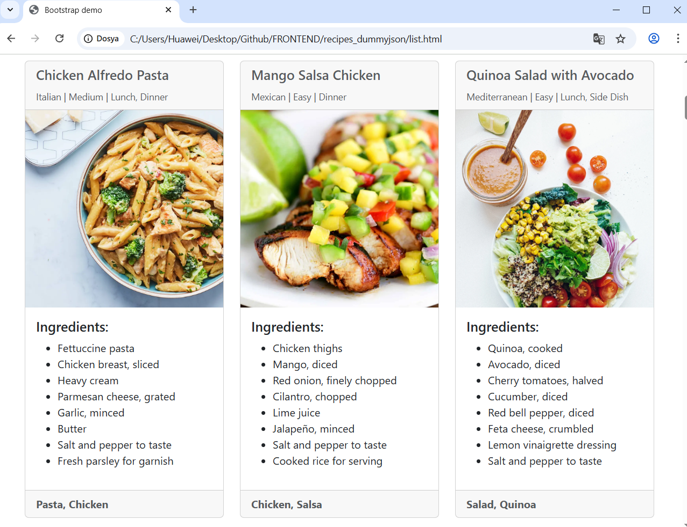

# Recipe App

A simple web application for learning JavaScript objects, API integration, and DOM manipulation using DummyJSON Recipe API.


## Description

This project demonstrates fundamental JavaScript concepts including object manipulation, fetch API usage, and dynamic content rendering. The app displays recipes fetched from an external API in a responsive Bootstrap layout.

## Features

- **API Integration**: Fetches real recipe data from DummyJSON API
- **Dynamic Content**: Renders recipe cards using JavaScript DOM manipulation
- **Recipe Details**: Shows ingredients, cooking time, difficulty, and cuisine type
- **Responsive Design**: Bootstrap 5 grid system with responsive cards
- **Error Handling**: Basic error handling with console logging
- **Object Manipulation**: Demonstrates JavaScript object access and array methods

## Technologies Used

- **HTML5** - Page structure
- **CSS3** - Custom styling (minimal)
- **JavaScript (ES6)** - API calls and DOM manipulation
- **Bootstrap 5.3.5** - Responsive UI framework
- **Font Awesome 6** - Icon library
- **DummyJSON API** - Recipe data source

## Learning Objectives

This project demonstrates:
- JavaScript object structure and property access
- Fetch API for external data retrieval
- Promise handling with `.then()` and `.catch()`
- DOM manipulation with `innerHTML`
- Array methods like `.join()`
- Template literals for HTML generation
- Bootstrap component integration

## Key JavaScript Concepts

### Object Structure
```javascript
const recipe = {
    id: 1,
    name: "Classic Margherita Pizza",
    ingredients: ["Pizza dough", "Tomato sauce"],
    prepTimeMinutes: 20,
    cookTimeMinutes: 15
}
```

### API Integration
```javascript
fetch('https://dummyjson.com/recipes')
    .then(response => response.json())
    .then(data => console.log(data))
```

### Dynamic HTML Generation
```javascript
container.innerHTML = `<div class="card">${data.name}</div>`
```

## Usage

1. Open `index.html` in a web browser
2. The app will automatically fetch and display recipes
3. View recipe statistics (total, limit, skip) in the info alert
4. Browse through recipe cards with ingredients and details

Or serve locally:
```bash
python -m http.server 8000
# Navigate to http://localhost:8000
```

## API Endpoint

- **All Recipes**: `https://dummyjson.com/recipes?limit=0`
- **Single Recipe**: `https://dummyjson.com/recipes/1`

## Recipe Data Structure

```javascript
{
  id: 1,
  name: "Recipe Name",
  ingredients: ["ingredient1", "ingredient2"],
  instructions: ["step1", "step2"],
  prepTimeMinutes: 20,
  cookTimeMinutes: 15,
  servings: 4,
  difficulty: "Easy",
  cuisine: "Italian",
  image: "recipe-image-url",
  tags: ["Pizza", "Italian"],
  mealType: ["Dinner"]
}
```
---

*This is a learning project created for JavaScript and API integration practice.*
